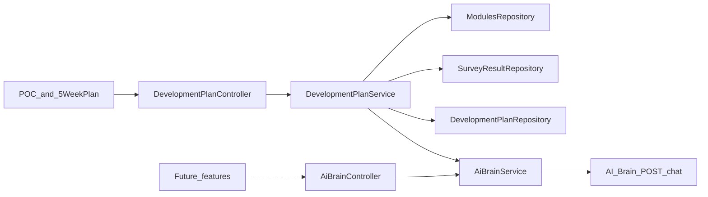

# AI-Brain Integration Guide

## Purpose
This document explains how Leadership Compass integrates with the TGG AI-Brain to generate personalised 5-week development plans from:

- the current active learning modules in Leadership Compass
- the user’s five leadership language scores
- the Anton/TGG knowledge base stored in the AI-Brain RAG system

## Current architecture



### Leadership Compass (this repo)
- Owns users, modules, survey scores, and persisted development plans.
- `DevelopmentPlanService` builds prompts, validates/parses plan JSON, applies score-weighted week allocation, and falls back when AI is unavailable.
- `AiBrainService` is the reusable HTTP client for AI-Brain `/chat`.
- `AiBrainController` (`POST /api/ai-brain/chat`) is a thin authenticated facade for future callers (for example activity critique). It is not required by the 5-week plan flow.

### AI-Brain (separate service)
- FastAPI app (typically `http://127.0.0.1:8000` locally).
- ChromaDB vector store + Ollama embeddings/chat models.
- Receives a natural-language prompt and returns an answer string (prompted here to be JSON).

## Configuration
In `backend/src/main/resources/application.properties`:

```properties
app.ai-brain.enabled=true
app.ai-brain.base-url=http://127.0.0.1:8000
app.ai-brain.timeout-seconds=120
```

For a hosted AI-Brain, change `app.ai-brain.base-url` to the remote service URL.

## Request flow
1. User completes the survey (survey team owns capture/persistence).
2. Leadership Compass reads the latest `SurveyResult` (or mock scores for POC preview).
3. Active modules are loaded from the database.
4. `DevelopmentPlanService` builds a compact prompt (scores + module id/category/title + week category targets).
5. `AiBrainService` posts to AI-Brain `/chat`.
6. The answer is parsed as JSON weeks; invalid/missing weeks are filled via the score-weighted fallback.
7. Plans can be persisted (`POST /api/development-plans/generate`) or previewed (`POST /api/development-plans/preview`).

## API surface (development plans)
- `GET /api/development-plans/current` — newest saved plan for the authenticated user
- `GET /api/development-plans` — plan history summaries (newest first)
- `GET /api/development-plans/{id}` — one saved plan owned by the caller
- `POST /api/development-plans/generate` — create and **persist a new snapshot** from latest survey scores (older plans are kept)
- `POST /api/development-plans/preview` — POC preview from mock scores (not persisted)

## Database storage
Each generate inserts a new `development_plans` row plus related `development_plan_weeks` (and action items).

| Entity | Purpose |
|--------|---------|
| `development_plans` | Plan snapshot: `id`, `user_id`, score snapshot, `generation_source`, `generated_at` |
| `development_plan_weeks` | Weeks 1–5: `module_id`, denormalised title/category, focus, rationale |
| `development_plan_week_actions` | Action items per week |

“Current plan” = latest `generated_at` for the user. History = all other snapshots for that user. Module title/category are denormalised so old plans stay readable if modules later change.

## Score-weighted planning
Weaker categories receive more weeks. Stronger categories may be omitted. When all scores are equal, the plan is balanced across categories.

## Fallback strategy
If AI-Brain is disabled, unreachable, or returns unusable JSON, Leadership Compass still builds a plan by ranking categories by score and selecting active modules accordingly.

## Frontend
- `frontend/ai-plan-poc.html` — mock-score POC
- `frontend/5weekplan.html` — saved/generated plan page
- Dashboard includes an **Open AI Plan POC** entry point

## Out of scope for this branch
- Survey submission / survey UI (owned by the survey team)
- Generic API health endpoints unrelated to AI-Brain
- Activity critique (future consumer of `AiBrainService` / `AiBrainController`)

## Future improvements
- Hosted AI-Brain with secure network access
- Dedicated AI-Brain `/development-plan` endpoint with schema validation
- Critique of user activity responses against plan actions
- Plan regeneration after a new survey submission
